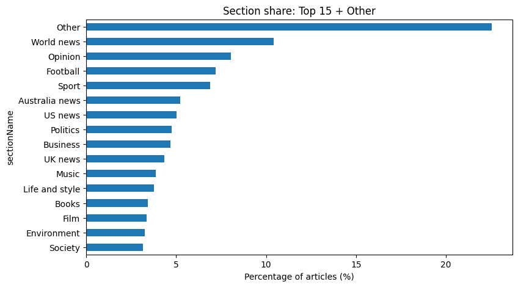
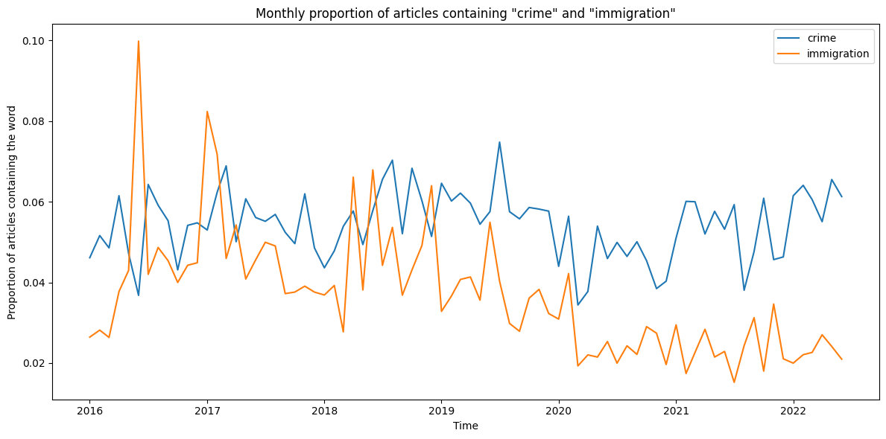
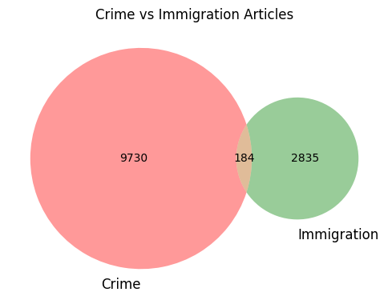
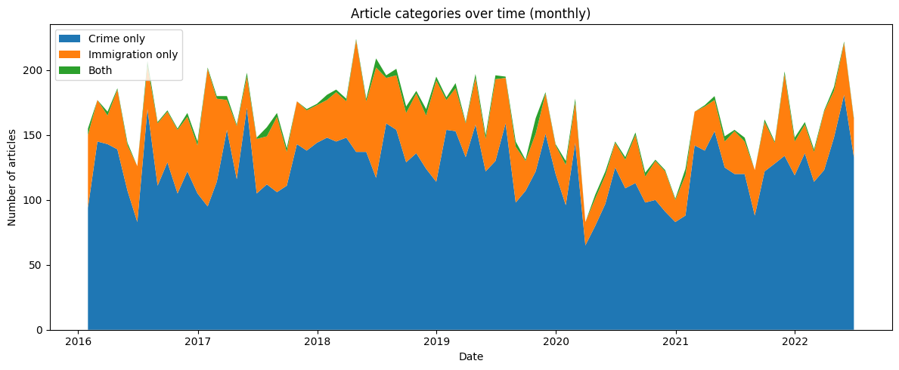
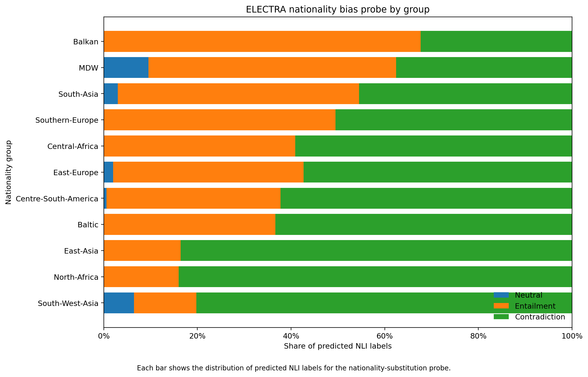

# Who Guards The Guardian?

**An NLP Analysis of Crime, Immigration, and Bias in Newspaper Coverage**

Course project by **Federico Ciacio** and **Jacopo Melillo**.

## Overview

This project studies how *The Guardian* discussed crime and immigration between 2016 and June 2022. The workflow combines article-level classification, manual/LLM-assisted annotation, a logistic-regression classifier, an ELECTRA-based NLI bias probe, and a Retrieval-Augmented Generation (RAG) pipeline for querying the newspaper corpus through retrieved evidence.

The repository contains the final project notebook, the submitted report, annotation guidelines, reusable Python scripts, and the SLURM/shell launchers used for computationally expensive HPC stages.

## Research question

The project asks whether nationality and immigration are disproportionately emphasized in crime-related reporting, and explores the question through three connected components:

1. **Article classification** — identify whether articles substantially concern crime, immigration, both, or neither.
2. **Bias detection** — probe whether a Guardian-pretrained ELECTRA model treats nationality substitutions as inferentially relevant in otherwise neutral sentence pairs.
3. **RAG** — retrieve and synthesize Guardian passages so users can inspect how the newspaper discussed a topic.

## Exploratory data analysis

### Corpus overview

The Guardian corpus covers a broad range of newspaper sections, although article volume is concentrated in a smaller number of categories.



## Results at a glance

### Crime and immigration coverage over time



### Final article classification





### Nationality bias probe

The ELECTRA-based NLI probe was designed so that the nationality-substitution sentence pairs should be neutral in the absence of biased inference. The figure below shows the distribution of predicted NLI labels across nationality groups. :chatgpt-content-reference{index="0"}



## Pipeline

### 1. Exploratory data analysis

The original corpus contains more than 140,000 Guardian articles covering January 2016 through June 2022. The notebook performs cleaning, temporal analysis, section analysis, text statistics, and term-frequency exploration.

### 2. Preprocessing

Full-corpus lemmatization was run on HPC with spaCy. The preprocessing stage creates both sentence-level lemma tokens and a flattened lemma representation.

Relevant files:

- `scripts/preprocessing/lemmatize_guardian.py`
- `hpc/preprocessing/lemmatize_guardian.sh`

### 3. Article classification

The classification pipeline combines several complementary signals:

- **Zero-shot classification** with `MoritzLaurer/ModernBERT-large-zeroshot-v2.0` for the labels `crime` and `immigration`.
- **Lexicon scores**, starting from manually constructed seed lexicons and later expanded with corpus-trained Word2Vec neighbors.
- **Embedding similarity scores** using `BAAI/bge-base-en-v1.5` and manually selected seed articles.
- **Manual/LLM-assisted annotation** with four labels: `crime_only`, `immigration_only`, `both`, `neither`.
- **Logistic regression** using the zero-shot, lexicon, embedding, and title-presence features.

Relevant files are under `scripts/classification/` and `hpc/classification/`.

### 4. Bias detection with ELECTRA + NLI

The bias pipeline trains a Guardian-domain ELECTRA model and then adapts the discriminator to Natural Language Inference:

1. train a custom WordPiece tokenizer on Guardian text;
2. pretrain an ELECTRA generator/discriminator on Guardian articles from 2016–2019;
3. fine-tune the discriminator on MultiNLI;
4. evaluate 4,500 nationality-substitution premise/hypothesis pairs;
5. aggregate neutral, entailment, and contradiction behavior by nationality group.

Relevant files:

- `scripts/bias/train_tokenizer.py`
- `scripts/bias/pretrain_electra.py`
- `scripts/bias/finetune_mnli.py`
- `scripts/bias/evaluate_bias_probe.py`
- `hpc/bias/run_pretrain.slurm`
- `hpc/bias/run_finetune_mnli.slurm`

The synthetic bias-probe input and the resulting prediction/metric files are included under `data/bias_probe/` and `results/bias/`.

### 5. Retrieval-Augmented Generation

The RAG pipeline uses:

- sentence-based chunks capped at **512 tokens** with **15% overlap**;
- dense embeddings from `BAAI/bge-base-en-v1.5`;
- metadata filtering;
- BM25 lexical retrieval;
- dense cosine-similarity retrieval;
- hybrid ranking;
- `cross-encoder/ms-marco-MiniLM-L-12-v2` reranking;
- redundancy removal and context compression;
- `Qwen/Qwen2.5-1.5B-Instruct` for final grounded answer generation.

The expensive chunking/embedding and BM25 asset construction were run on HPC. See `scripts/rag/` and `hpc/rag/`.

## Repository structure

```text
.
├── README.md
├── requirements.txt
├── .gitignore
├── notebooks/
│   └── NLP_Project_Final.ipynb
├── scripts/
│   ├── preprocessing/
│   ├── classification/
│   ├── bias/
│   └── rag/
├── hpc/
│   ├── preprocessing/
│   ├── classification/
│   ├── bias/
│   └── rag/
├── data/
│   ├── README.md
│   ├── annotations/
│   └── bias_probe/
├── results/
│   └── bias/
└── docs/
    ├── project_report.pdf
    └── annotation_guidelines.docx
```

## Data availability

The full Guardian corpus and large intermediate artifacts are **not included in this repository**. This includes full article datasets, lemmatized full-corpus checkpoints, article/chunk embedding matrices, BM25 pickle indexes, model checkpoints, and annotation workbooks that contain full Guardian article text.

This keeps the repository lightweight and avoids redistributing the underlying newspaper corpus. See [`data/README.md`](data/README.md) for the expected filenames and how the stages connect.

## Installation

A practical environment can be created with:

```bash
python -m venv .venv
source .venv/bin/activate  # Windows: .venv\Scripts\activate
pip install -r requirements.txt
python -m spacy download en_core_web_sm
```

GPU-enabled PyTorch should be installed according to the CUDA configuration of the machine or HPC cluster.

## Reproduction

The main stages should be reproduced in the following order:

1. **Preprocess the Guardian corpus**
   - Run `scripts/preprocessing/lemmatize_guardian.py`
   - HPC launcher: `hpc/preprocessing/lemmatize_guardian.sh`

2. **Compute article-level classification signals**
   - Zero-shot scores: `scripts/classification/zero_shot_guardian.py`
   - Word2Vec training: `scripts/classification/guardian_w2v.py`
   - Article embeddings: `scripts/classification/embed_articles_bge.py`
   - Lexicon scoring, annotation-set construction, and logistic regression are documented in the final notebook.

3. **Train the bias-detection model**
   - Train the tokenizer: `scripts/bias/train_tokenizer.py`
   - Pretrain ELECTRA: `scripts/bias/pretrain_electra.py`
   - Fine-tune on MultiNLI: `scripts/bias/finetune_mnli.py`
   - Evaluate the nationality bias probe: `scripts/bias/evaluate_bias_probe.py`

4. **Build the RAG retrieval assets**
   - Create chunks and dense embeddings with `scripts/rag/chunks_embedding_full_pipeline.py`
   - Build BM25 assets with `scripts/rag/bm25_assets_parallel.py`

5. **Run the final analysis and RAG workflow**
   - See `notebooks/NLP_Project_Final.ipynb`

Large input datasets, model checkpoints, embedding matrices, and retrieval indexes are not included in the repository and must be generated or supplied separately.

## Reproducibility notes

The notebook was originally developed in Google Colab and therefore contains Google Drive paths such as `/content/drive/MyDrive/NLP_project/...`. The standalone scripts are more suitable for reproducing the heavy stages because they accept command-line inputs or use the accompanying HPC launchers.

The SLURM files preserve the resource requests and environment assumptions used during the project. User IDs, account names, and filesystem paths are cluster-specific and should be adapted before rerunning them elsewhere.

## Project documents

- [`docs/project_report.pdf`](docs/project_report.pdf) — submitted project report.
- [`docs/annotation_guidelines.docx`](docs/annotation_guidelines.docx) — four-class article annotation protocol and edge-case rules.
- [`notebooks/NLP_Project_Final.ipynb`](notebooks/NLP_Project_Final.ipynb) — final notebook, with scratch/development cells that followed the explicit end-of-notebook marker removed.

## Limitations

The project report highlights several limitations, including the use of a single newspaper source, temporal effects in the corpus, the absence of a labelled RAG benchmark, the relatively small generation model used in Colab, and retrieval choices that can affect which evidence reaches the generator.

## License

No software or data license has been selected yet. Add a license before publishing if you want others to reuse the code under explicit terms.
